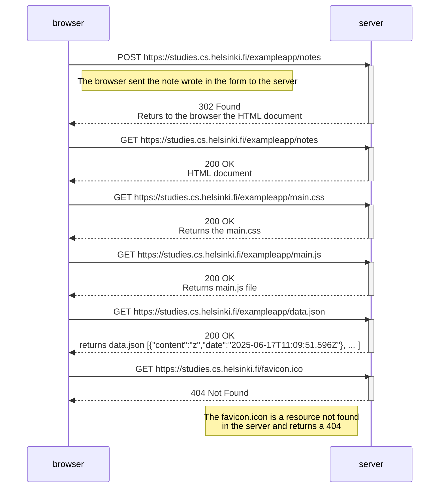

# New Note Sequence Diagram

``` mermaid
    sequenceDiagram
    participant browser
    participant server

    browser->>server: POST https://studies.cs.helsinki.fi/exampleapp/notes
    activate server
    Note right of browser: The browser sent the note wrote in the form to the server
    server-->>browser: 302 Found <br> Returs to the browser the HTML document
    deactivate server

    browser->>server: GET https://studies.cs.helsinki.fi/exampleapp/notes
    activate server
    server-->>browser: 200 OK <br> HTML document
    deactivate server

    browser->>server: GET https://studies.cs.helsinki.fi/exampleapp/main.css
    activate server
    server-->>browser: 200 OK <br> Returns the main.css
    deactivate server

    browser->>server: GET https://studies.cs.helsinki.fi/exampleapp/main.js
    activate server
    server-->>browser: 200 OK <br> Returns main.js file
    deactivate server

    browser->>server: GET https://studies.cs.helsinki.fi/exampleapp/data.json
    activate server
    server-->>browser: 200 OK <br> returns data.json [{"content":"z","date":"2025-06-17T11:09:51.596Z"}, ... ]
    deactivate server

    browser->>server: GET https://studies.cs.helsinki.fi/favicon.ico
    activate server
    server-->>browser: 404 Not Found
    deactivate server
    Note left of server: The favicon.icon is a resource not found <br>in the server and returns a 404
```